# SenseCAP HA Panel

**A Home Assistant control panel on a $60 4" touchscreen.**

> ESPHome + LVGL on the Seeed SenseCAP Indicator — five pages of lights,
> climate, energy and security, live data pushed from Home Assistant, readable
> from across the room, MIT-licensed. Plus a Tamagotchi that only levels up
> when you actually get work done.

**Status:** the panel has been running on my desk since August 2026. This repo
is a *new assembly* of it — the reusable patterns, the full write-up, and the
desk pet as a complete worked page. Read
[`docs/LIMITATIONS.md`](docs/LIMITATIONS.md) before you build from it.

<!-- ─────────────────────────────────────────────────────────────────────────
     VIDEO GOES HERE — replace this whole comment block with the embed:

     [](https://youtu.be/VIDEO_ID)

     Shape that works for this project, roughly 90 seconds:
       0:00  the panel on the desk, nav bar, tab through two or three pages
             so the first thing a viewer sees is a control panel
       0:20  one real control doing a real thing — tap a light, watch it
             change, ideally with the light in frame
       0:35  the energy page and the grid badge, since that is the
             best-engineered bit
       0:50  the pet: level, needs bars, feed it, one round of a game
       1:20  the main-page tile, so it is clear the pet is one page of many

     Stills for docs/media/, referenced from the sections below:
       panel-main.jpg   the main page with the nav bar
       panel-energy.jpg the energy page with the grid badge
       pet-page.jpg     the pet page
       pet-tile.jpg     the main-page tile with its two status bars
     ───────────────────────────────────────────────────────────────────────── -->

> **Video coming.** Until then — these are not mockups. Every still below was
> captured **from the running panel by the panel itself**, over the
> screenshot endpoint described in
> [Remote view and control](#remote-view-and-control).

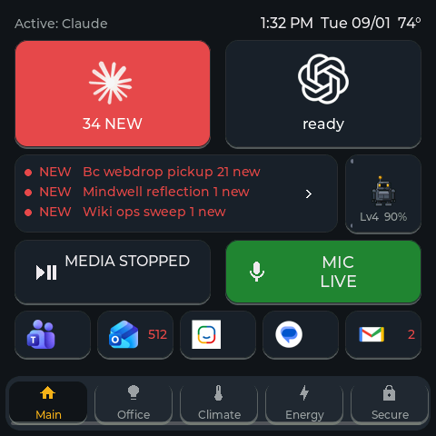

*The main page: agent status tiles, the notification strip, the pet's tile
(Lv4, 50%), media and mic state, app badges, and the nav bar.*

| | |
|---|---|
| 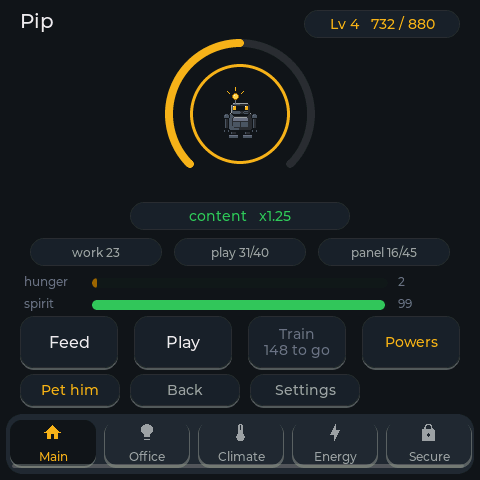 | 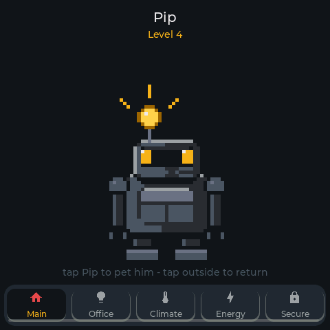 |
| The pet page: XP ring, mood, needs, the day's earnings split | Tap him for fullscreen — the 64px sprite at a crisp 5x |
| 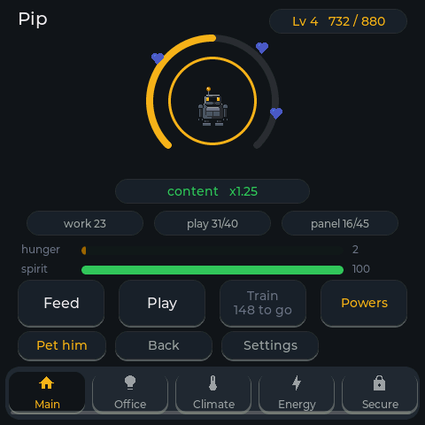 | 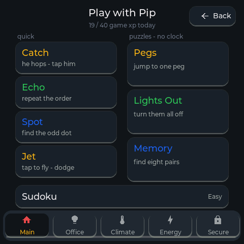 |
| Blue hearts: he knows this pet came from the *agent's* virtual finger, not mine | Eight games: four quick, three untimed puzzles, daily sudoku |
| 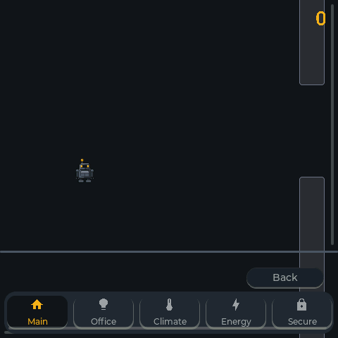 | 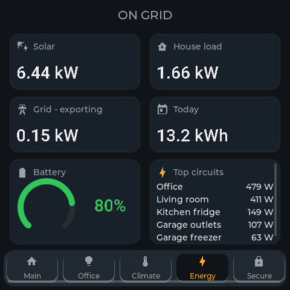 |
| Jet — tap to thrust, dodge pylons. This frame was captured while the agent was playing it remotely | Energy, with the top-5 live circuits; tap for all 22 |

The pet's eight growth stages are
[`images/pet/stage1.png`](images/pet/) through `stage8.png`, at their real
size, which is 64x64.

---

## What this is

A wall or desk panel for Home Assistant. The Indicator ships with Seeed's own
MQTT demo firmware; this replaces it with ESPHome driving LVGL, talking to
Home Assistant over the native API.

Mine runs five top-level pages plus a dozen sub-pages: room lights and scenes,
a climate dial, an energy page with solar and battery, door locks and garage
doors, media transport, and a set of work controls. **Those pages are not in
this repo**, because they are welded to my entity ids, my rooms and my
hardware, and publishing them would be publishing my house rather than a
project. They are, however, worth seeing — this is what the patterns in this
repo build up to:

| | |
|---|---|
| 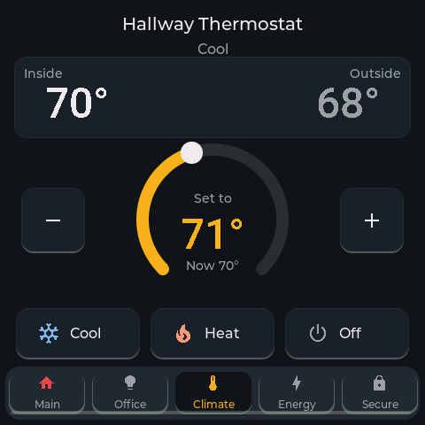 | 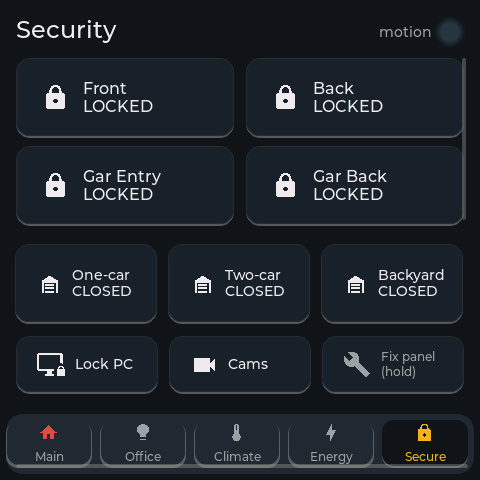 |
| **Climate** — one dial, current + outside temp, three modes. The most-used page on the panel | **Security** — locks are tap-to-lock, **long-press to unlock**; garage doors are long-press only |
| 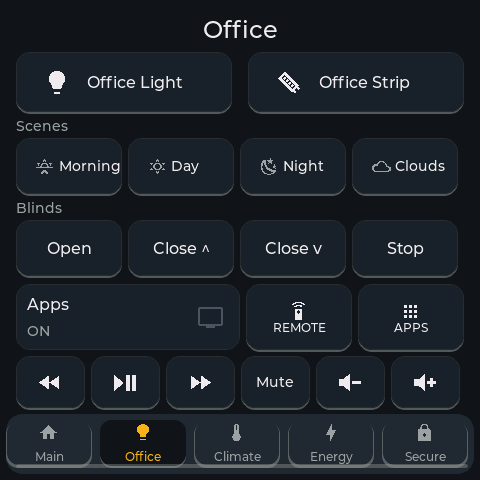 | 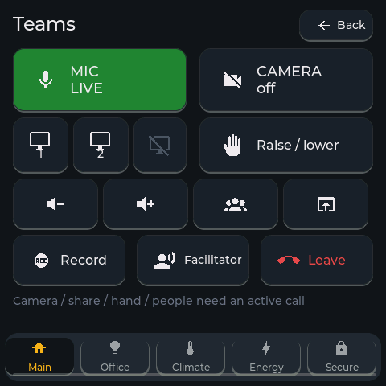 |
| **Office** — lights, scenes, blinds, TV, media transport | **Teams** — the page that got the screen out of the drawer: mic, camera, share, hand, leave |
| 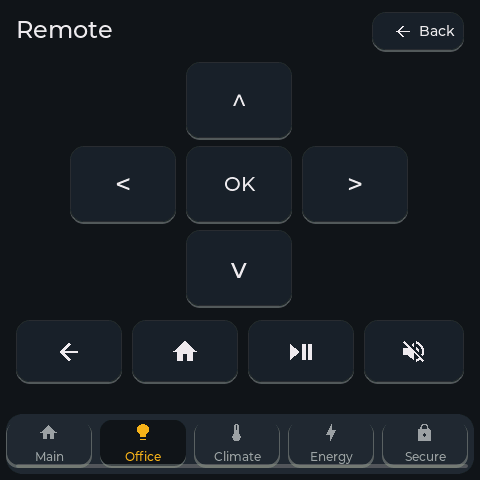 | 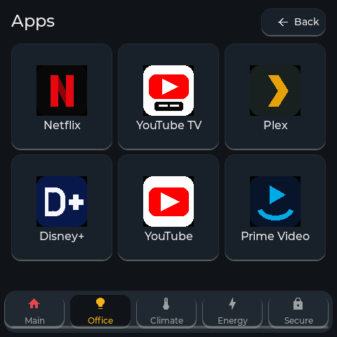 |
| A sub-page done plainly: a D-pad remote off the Office page | The app launcher, another sub-page — names, not reverse-DNS ids |

What is here is the part that transfers:

- **[`docs/00-panel-guide.md`](docs/00-panel-guide.md)** — the main document.
  Architecture, the nav-bar arithmetic, how to get values to arrive reliably,
  every trap that cost me an evening, where the latency actually goes, and a
  worked example built from a real power outage.
- **[`esphome/patterns/`](esphome/patterns/)** — self-contained snippets:
  tile and nav styles, sub-pages, optimistic tiles, two-stage ambient idle, the
  encoded-state sensor, and a status badge that does not lie.
- **A complete worked page: the desk pet.** In full, with its Home Assistant
  package, its sprites and its games, because it is self-contained and it
  exercises every pattern above at once.

## What you need

| | |
|---|---|
| **Hardware** | A [Seeed SenseCAP Indicator **D1**](https://www.seeedstudio.com/SenseCAP-Indicator-D1-p-5643.html), around $60 USD at time of writing. 4" 480x480, ESP32-S3, 8MB flash, octal PSRAM, FT5X06 touch. |
| **Also works on** | D1S / D1Pro. Their extra air-quality sensors hang off the RP2040 and nothing here uses them. |
| **Software** | Home Assistant, and ESPHome (the "ESPHome Device Builder" add-on, or standalone). |
| **A USB-C cable** | First flash only. Everything after that is OTA. |
| **Total cost** | The panel. That is the whole bill of materials. |

## The panel, in short

**Home Assistant holds state. The panel is a view.** Nothing durable lives on
the device: reflashing is routine, `restore_value: true` is NVS rather than a
database, and the interesting data is not on the ESP32 anyway.

**Five nav tabs is the ceiling.** 86px each is 430px inside a 456px bar. A
sixth needs every tab under 76px and reflows everything. Past five, use
sub-pages off a tile with an explicit Back button.

**Values arrive by push, so the first paint is empty.** Measured: in the 14
seconds after boot, exactly one of my subscriptions received a value. Repaint
from a script on a 30-second interval and ask HA to re-emit slow entities on
`api: on_client_connected:`.

**Encode related values into one sensor.** Nine numbers that always change
together are one fact. Watch the 255-character state cap.

All of that, with the reasoning, is in
[`docs/00-panel-guide.md`](docs/00-panel-guide.md).

## The three traps that cost an evening each

**A label inside a styled container renders dark-on-dark** unless it names its
own `text_color`. LVGL's default theme re-asserts a dark color inside plain
`obj` containers, overriding the screen-level setting. Button labels are
unaffected, which is why one page looks perfect while another looks like every
sensor is broken. It is completely convincing as a data bug. Three wrong
diagnoses before I diffed the widget definitions instead of the data.

**A clean compile is not evidence that anything renders.** The panel will
compile, flash, boot, and show you a blank area with no tool reporting a
problem. Verify against the running device.

**Never POST a fake state to an entity id a device will later own.** It creates
a real entity registry entry; the device then silently claims a `_2` suffix,
and your automation watches a corpse that never changes again. Nothing errors,
nothing logs, the feature is just dead, and the suffix is sticky.

**"OTA successful" is not evidence the new build is running.** If the new
firmware crashes on its first boot — for me, LVGL's one-time boot theme walk
finally outgrew the default 5-second task watchdog — the bootloader silently
rolls back, the *old* app answers the network, and every check you'd
naturally write passes. Three consecutive "successful" deploys ran invisible
before a human noticed a missing feature. Verify the device's reported build
timestamp after every flash, or better, look at actual pixels (next section).

## Remote view and control

[`esphome/components/panel_snapshot/`](esphome/components/panel_snapshot/) —
about 200 lines of external component that turn the panel into something you
(or your agent) can see and drive over the LAN:

- `GET :8080/screenshot` — the live screen as a 480x480 RGB565 BMP. Pixel
  source is a **flush-callback tap** mirroring every drawn region into a
  PSRAM shadow framebuffer. Not `lv_snapshot_take()`: ESPHome's LVGL managed
  component ships *without* the snapshot module's sources, so that API can
  never link, whatever Kconfig says.
- `GET :8080/tap?x=..&y=..` — a 120 ms synthetic tap via a second LVGL
  pointer device, polled exactly like the real touchscreen. **Tap-only on
  purpose**: anything you guard with a long-press on the glass (my lock page
  does) stays physically-present-only.
- `GET :8080/view` — the two combined into a remote control: a page with the
  screenshot refreshing every 1.5 s, where clicking the image taps the panel
  at that spot. Leave it open in a tab; it works from a phone.

Together they close the verification loop that the trap above opens: after an
OTA, fetch a screenshot and *look*. Every still in this README was taken this
way. Three hard-won notes are in the component's comments: the missing
snapshot sources, the absent `lv_display_get_flush_cb` (read the member via
`lv_display_private.h`), and the byte-swapped RGB565 pipeline you will
discover as a pink-on-cyan first capture.

It is LAN-open and unauthenticated by design — the same trust boundary as the
rest of a home LAN. If your network is not that, put it behind something.

## The desk pet

One page, and the reason most people will click.

It hatches from an egg and grows through eight stages. It earns XP from things
you did: touches on the panel, rounds of its minigames, and (in my setup, not
in this repo) agent output volume, git commits and issues shipped.

Two needs. **Hunger** is about care and feeding fixes it. **Spirit** is about
attention and only playing fixes it, so a pet that is fed and ignored still
fades.

**Decay stops when you are not there.** Five gates, each a one-line template
condition:

| Gate | Reads | Covers |
|---|---|---|
| **Away** | `person.CHANGE_ME_you` | a week off, a weekend away |
| PC locked | a session-state sensor | lunch, the evening |
| Monitor off | a monitor-power sensor | you walked away without locking |
| In a call | anything reporting `call=1` | you are busy at the desk |
| Incident | anything reporting `hot=<n>` | it is 2am and this is not the moment |

**Wire up Away first.** One line, using the standard Home Assistant `person`
entity your phone's app already updates. Swap `person.CHANGE_ME_you` for yours
from **Settings → People** and you are done. It is the difference between a pet
and an obligation. Everything else is optional refinement.

It cannot die, cannot lose a level, has no streaks, no notifications, no
sounds, and no sad text. It has no route to your attention that you did not
open yourself.

At level 3 it unlocks a power, then another at 4, 5 and 6. A power is a button
that does something you could already do by hand:

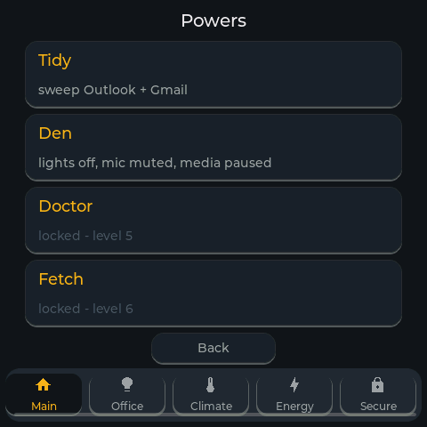

*Two unlocked at level 4, two still earning. A power never sends, deletes,
moves or spends anything.*

Eight minigames: catch the pet, echo, spot the odd one out, a flappy-style
jetpack game, peg solitaire, lights out, memory pairs, and a daily sudoku with
a generated puzzle bank. All eight, on the glass:

| | |
|---|---|
| 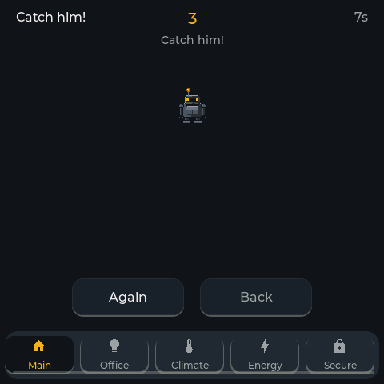 | 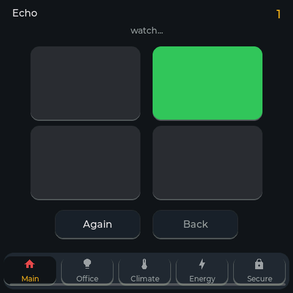 |
| **Catch** — he hops, you tap. Ten seconds a round | **Echo** — watch the pads, play them back |
| 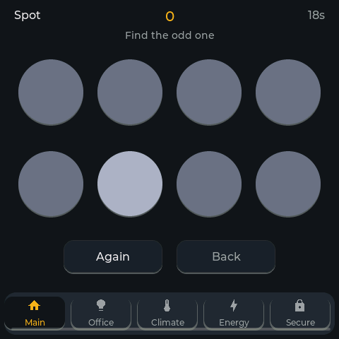 | 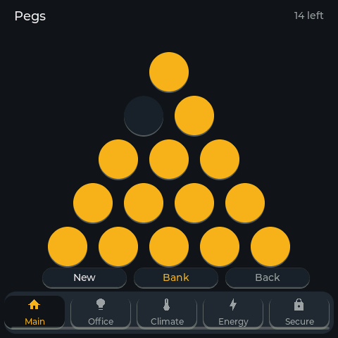 |
| **Spot** — find the odd one before the clock does | **Peg solitaire** — untimed, fourteen to one |
| 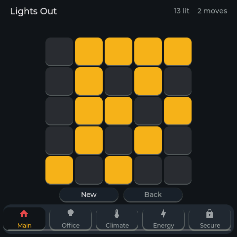 | 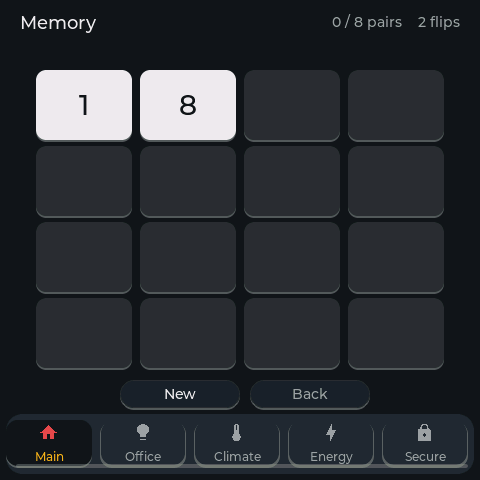 |
| **Lights Out** — the 1995 classic, 5x5 | **Memory** — eight pairs, counted in flips |
| 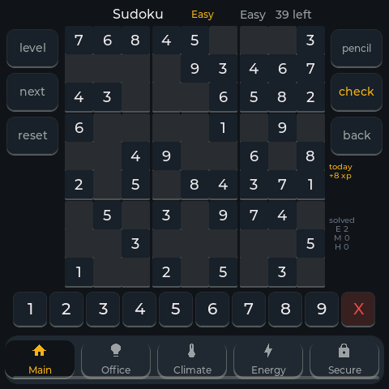 | 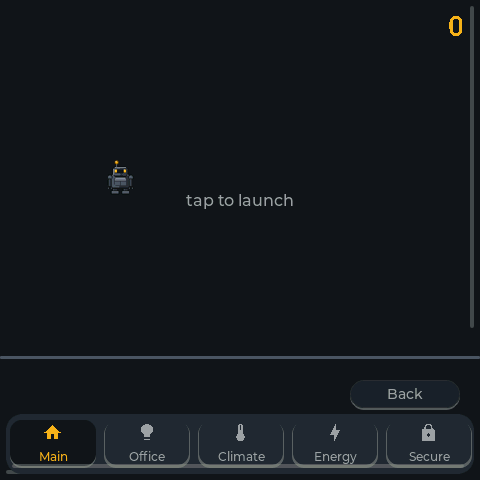 |
| **Sudoku** — a daily puzzle from a generated bank, three difficulties, pencil marks | **Jet** — tap to thrust (mid-flight shot at the top of this page) |

On my desk the pet has since grown well past what this repo ships — a
procedurally-drawn robot with fifty-odd animation frames (blink, wave, droop
when neglected, sleep at night, a signature move per level), and a seeded
evolution system that rebuilds him from modular head/body/arms/legs parts.
The stills above show that build. What is *in this repo* is the honest,
complete slice-1 loop the write-ups describe; the rest is documented in
[`docs/desk-pet/`](docs/desk-pet/) as design if you want to grow yours the
same direction.

Every one of those choices has a reason, in
[`docs/desk-pet/`](docs/desk-pet/).

### The part I would most want you to steal

Before wiring a counter to a reward, check what fraction of it a machine
produces while you are asleep.

My first draft scored total agent tokens. Over a measured week, **95.8% of that
volume was cache reads** — an agentic loop re-reading its own cached prompt on
every turn, which is a property of the harness and not of anything I did. The
pet would have earned 23.9 times its entire weekly budget for sitting still.

Same shape twice more: my notes repo produced 1,089 commits in 30 days against
134 in real code repos, most of them from an hourly snapshot timer; and 59 of
111 closed issues were filed by an automated scanner where one dependency bump
closes nine.

None of those signals are broken. They all go up reliably. They just do not
mean what a reward should mean, and nothing warns you.

Numbers and the resulting XP budget:
[`docs/desk-pet/02-progression-and-evolution.md`](docs/desk-pet/02-progression-and-evolution.md) §1.

## What is in here

```
docs/
  00-panel-guide.md          THE main document — read this first
  LIMITATIONS.md             read this second
  desk-pet/                  the pet's own design docs
  media/                     stills, captured by the panel itself
esphome/
  patterns/                  reusable panel snippets, each with its reasoning
  components/panel_snapshot/ remote view + touch (screenshot/tap over HTTP)
  example-device.yaml        a minimal device config
  desk-pet.pkg.yaml          the pet page, its games and its sprites
  main-page-tile.snippet.yaml   the pet's tile for your own main page
  desk_pet_helpers.h         the encoded-state parser
  secrets.yaml.example
homeassistant/packages/
  desk_pet.yaml              helpers, decay gates, XP automations, powers
  desk_pet_sudoku_bank.yaml
  desk_pet_sudoku_daily.yaml
tools/                       sprite and puzzle generators
images/pet/                  the eight sprites, 64x64 PNG
agent/
  SEED-PROMPT.md             paste into your agent before it touches anything
  skill/SKILL.md             the same, as an installable skill
```

## Getting it running

**Read [`docs/LIMITATIONS.md`](docs/LIMITATIONS.md) first.** Short version:
every block here runs on my desk, but this repo is a *new assembly* of those
blocks and it has not been through a compiler in this exact shape.

1. Copy `esphome/secrets.yaml.example` to `secrets.yaml` and fill it in.
2. Copy `homeassistant/packages/*.yaml` into your HA `packages/` directory.
   **Grep for `CHANGE_ME` and deal with every hit.** They are all optional; a
   placeholder pointing at nothing makes a feature inert rather than broken.
3. Seed the settings values listed at the top of `desk_pet.yaml`. A fresh
   install starts with `pet_enabled: off` and earns nothing until you turn it
   on. This trips everybody, including me.
4. Restart HA. Confirm `sensor.indicator_pet` has a real state in
   **Developer Tools → States** before you touch the panel.
5. Fill in the `substitutions:` block in `esphome/example-device.yaml`, paste
   `main-page-tile.snippet.yaml` into `page_main`, then `esphome config` and
   `esphome compile`.
6. Flash over USB-C. Adopt the device in Home Assistant.
7. **On the device's page in HA, enable "Allow the device to perform Home
   Assistant actions".** Every button silently does nothing until you do.
   There is no error message.
8. **Look at the panel.** See the second trap above.

## Building this with an AI agent

Most of the LVGL work here was built with an agent, and it is the right tool
for the job: the YAML is long, repetitive and positional. A sudoku board is 81
near-identical widgets with different coordinates. Nobody should be typing
that.

The catch is that **your setup is not my setup**, so an agent starting from my
entity ids will write confident YAML against devices you do not own.

[`agent/SEED-PROMPT.md`](agent/SEED-PROMPT.md) is written to make the agent
**interview you first**. Its first output should be questions, not code: how
you reach Home Assistant and with what auth, whether ESPHome is the add-on or
standalone, what your device is actually called, what already exists that might
collide, and what you are willing to let it change.

It also carries the working rules — verify against the running device rather
than the compile log, and stop on the second identical failure — and every trap
above by name, so they cost you a paragraph instead of an evening.

Same content as an installable skill: [`agent/skill/SKILL.md`](agent/skill/SKILL.md).

## Limitations

Full page: [`docs/LIMITATIONS.md`](docs/LIMITATIONS.md). Headlines:

- **This assembly has not been compiled in this form.** The blocks work; the
  packaging is new.
- **Flash and RAM headroom are unmeasured.** Every byte budget in the docs is
  arithmetic. Read your own `Flash:` line.
- **My own control pages are not here.** The patterns are; the pages are my
  house.
- **The grid badge's alarm rendering is unverified**, because I have only had
  one outage and faking the state would have driven real hardware.
- **The pet's work-signal XP scorer is not in this repo.** Out of the box it
  earns from panel touches and games only, so it levels more slowly than the
  curve suggests.
- **Evolution, modular sprite parts, random power draws and accessories are
  designed but not built.**
- **No sound.** The buzzer is on the RP2040, behind stock firmware.

## Why

This screen was a Christmas gift from my wife, and it spent a year in a
drawer. I meant it to be a couch dashboard for the house; the dashboard I
built kinda sucked, I did not use it, and that was that — a gift, in a
drawer.

What revived it was wanting a Stream Deck: something on the desk to drive my
AI agents and my computer — above all my mic and camera, because most of my
working day is Teams calls. One tap to mute beats digging for the Teams
window mid-meeting, every single day. Once that worked, the house controls
came back along for the ride, done properly this time: five tabs, big
targets, words rather than color codes, legible from six feet.

The pet exists because the controls were fun enough that I wanted something
to play with while an agent ground through a task or a meeting ground on. I
had a Gigapet as a kid, my kids carry their own now, and this one is mine —
it only grows when I get things done, and the powers are how it keeps
earning its desk space.

The whole thing took two weeks with an AI agent, an idea, and evenings to
tinker. Solo it would have been months, if I could have reached this level
at all. It sits with me daily, so it keeps growing.

The parts worth stealing are in `docs/` and `esphome/patterns/`. The parts that
are just my house are not here.

## Roadmap

Nothing here is promised, and the panel works without any of it.

- **Evolution for the pet** — Ascendant state, seeded minor/major/epic rolls,
  pity counters, unbounded forms. Designed in full in
  [`docs/desk-pet/02-progression-and-evolution.md`](docs/desk-pet/02-progression-and-evolution.md),
  not built.
- **Modular sprite parts** — four families of six variants across head, body,
  arms and legs: 331,776 creatures for 102KB of flash, against 2.7GB if you
  baked them. [`docs/desk-pet/03-sprite-pipeline.md`](docs/desk-pet/03-sprite-pipeline.md).
- **More patterns**, as I build more pages worth generalising.
- **A measured flash figure**, replacing the arithmetic in the sprite doc.

## No secrets — ever

Nothing in this repo has ever contained a real credential.
`esphome/secrets.yaml.example` holds obvious dummies, `secrets.yaml` is
gitignored, and every entity ID from my own house has been replaced with a
`${entity_*}` substitution or a loud `CHANGE_ME_` placeholder.

Two things worth knowing if you fork it:

- **ESPHome substitutions expand inside lambdas.** That is genuinely useful and
  it is also how a password ends up baked into a compiled binary. Anything
  secret goes in `secrets.yaml` behind `!secret`.
- **If a credential has ever been committed, deleting the line is not the fix.**
  Rotating changes what you use; only revoking closes the old door.

## License

MIT. See [`LICENSE`](LICENSE). Take it, change it, sell it, whatever. Keep the
copyright line.

## Credits

The panel is Seeed's. ESPHome and LVGL do the heavy lifting. The pinout came
from [devices.esphome.io](https://devices.esphome.io/devices/seeed-sensecap/).

Everything else is mine, built at home, on my own time, on my own kit.
